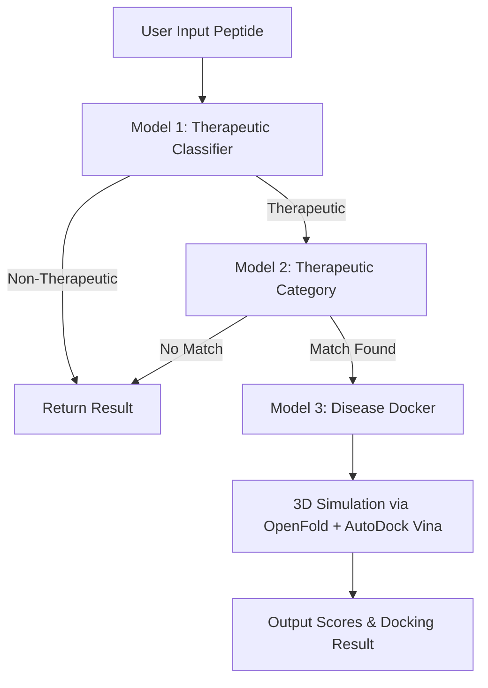

# 🧬 Therapeutic Peptide Finder


> Predict peptide therapeutics, their types, and simulate docking with disease targets using OpenFold + AutoDock Vina.

---

## 📋 Table of Contents

- [📖 Description](#-description)
- [🌟 Features](#-features)
- [🚀 Live Demo](#-live-demo)
- [🧩 Architecture Overview](#-architecture-overview)
- [🛠 Project Setup](#-project-setup)
  - [🔧 Frontend (React)](#-frontend-react)
  - [🧪 Backend (Flask + Models)](#-backend-flask--models)
  - [📦 OpenFold Setup](#-openfold-setup)
  - [⚗ AutoDock Vina Setup](#-autodock-vina-setup)
- [🔍 Models Summary](#-models-summary)
- [📊 Sample Output](#-sample-output)
- [🙋‍♂ Author](#-author)
- [📃 License](#-license)
- [🌈 Acknowledgments](#-acknowledgments)

---

## 📖 Description

*Therapeutic Peptide Finder* is a deep learning pipeline that:
1. Classifies peptides as *therapeutic or non-therapeutic*
2. Predicts the *therapeutic category*
3. Performs *3D docking simulations* with disease targets using OpenFold + AutoDock Vina

Built using *React + Flask*, without database integration.

---

## 🌟 Features

- 🔍 Therapeutic classification (*Model 1*)
- 🧠 Peptide function prediction (*Model 2*)
- 🔬 Disease docking simulation (*Model 3*)
- 🎯 Uses ProtBERT, CNN-BiLSTM, OpenFold & AutoDock Vina
- 🚫 Lightweight, no DB required

---

## 🚀 Live Demo

Coming soon...

---

## 🧩 Architecture Overview



---

## 🛠 Project Setup

### 🔧 Frontend (React)

```bash
# Navigate to frontend folder
cd therapeutic-peptide-finder/frontend

# Install dependencies
npm install

# Start the frontend server
npm run dev
```

---

### 🧪 Backend (Flask + Models)

```bash
# Navigate to backend
cd ../backend

# Create and activate virtual environment
python -m venv venv
source venv/bin/activate  # Windows: venv\Scripts\activate

# Install required Python libraries
pip install -r requirements.txt
```

**Sample `requirements.txt`:**

```text
torch
transformers
flask
biopython
numpy
pandas
scikit-learn
```

```bash
# Run Flask server
python app.py
```

---

### 📦 OpenFold Setup

```bash
# Clone OpenFold
git clone https://github.com/aqlaboratory/openfold.git
cd openfold

# Create a new conda environment (recommended)
conda create -n openfold python=3.8 -y
conda activate openfold

# Install dependencies
pip install -r requirements.txt

# Download pretrained weights (AlphaFold DB format)
bash scripts/download_openfold_params.sh <download_dir>
```

*OR manually:*

```bash
wget https://files.ipd.uw.edu/pub/openfold/openfold_params/finetuned_ptm_1.pt
mkdir -p openfold/resources/weights
mv finetuned_ptm_1.pt openfold/resources/weights/
```

---

### ⚗ AutoDock Vina Setup

```bash
# Download AutoDock Vina
wget https://github.com/ccsb-scripps/AutoDock-Vina/releases/download/v1.2.5/vina_1.2.5_linux_x86_64.tar.gz
tar -xvzf vina_1.2.5_linux_x86_64.tar.gz

# Move vina binary to /usr/local/bin (Linux)
sudo mv vina_1.2.5_linux_x86_64/vina /usr/local/bin

# For Windows, download .exe from:
# https://github.com/ccsb-scripps/AutoDock-Vina/releases

# Test if vina installed correctly
vina --help
```

---

## 🔍 Models Summary

| Model | Task | Framework | Input | Output |
|-------|------|-----------|--------|--------|
| *Model 1* | Therapeutic vs Non-Therapeutic | ProtBERT + CNN-BiLSTM | Peptide Sequence | Boolean |
| *Model 2* | Therapeutic Category | ProtBERT + CNN-BiLSTM | Peptide Sequence | Category (e.g. Antiviral, Anticancer) |
| *Model 3* | Docking Simulation | OpenFold + AutoDock Vina | Peptide + Disease Structure | Docking Score + Interaction Map |

---

## 📊 Sample Output

```json
{
  "Sequence": "GVGVPGLGVG",
  "Model_1": "Therapeutic",
  "Model_2": "Antiviral",
  "Disease_Selected": "HIV-1 Protease",
  "Docking_Score": "-8.7 kcal/mol",
  "Binding_Affinity": "High",
  "Biological_Features": {
    "Hydrophobicity": "Moderate",
    "Polarity": "Low",
    "Charge": "+1",
    "Stability": "High"
  }
}
```

---

## 🙋‍♂ Author

*Surya HA* 🔗 [LinkedIn](https://www.linkedin.com/in/surya-ha-9a0a5a291/)  

*KS Venkatram* 🔗 [LinkedIn](https://www.linkedin.com/in/venkatram-krishnapuram/)  

*Sanggit Saaran KCS* 🔗 [LinkedIn](https://www.linkedin.com/in/sanggit-saaran-k-c-s/)  

*Vishal Seshadri B* 🔗 [LinkedIn](https://www.linkedin.com/in/vishal-seshadri-b-b82074289/)  

Passionate about 🧬 Bioinformatics, 🧠 Deep Learning, and 🌐 Full Stack Dev  

---

## 📃 License

MIT License – Free for personal & commercial use.

---

## 🌈 Acknowledgments

- [ProtBERT](https://huggingface.co/Rostlab/prot_bert) by RostLab  
- [OpenFold](https://github.com/aqlaboratory/openfold)  
- [AutoDock Vina](http://vina.scripps.edu/)  
- HuggingFace, Biopython, Flask, React communities 💖
